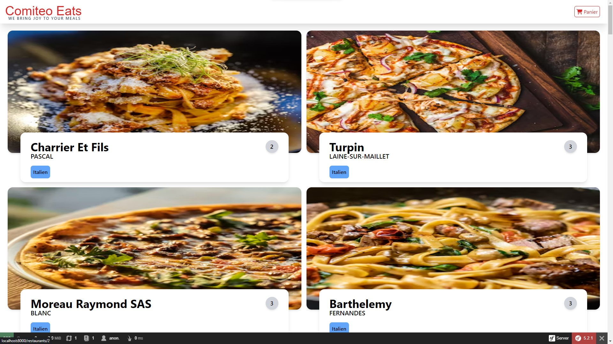
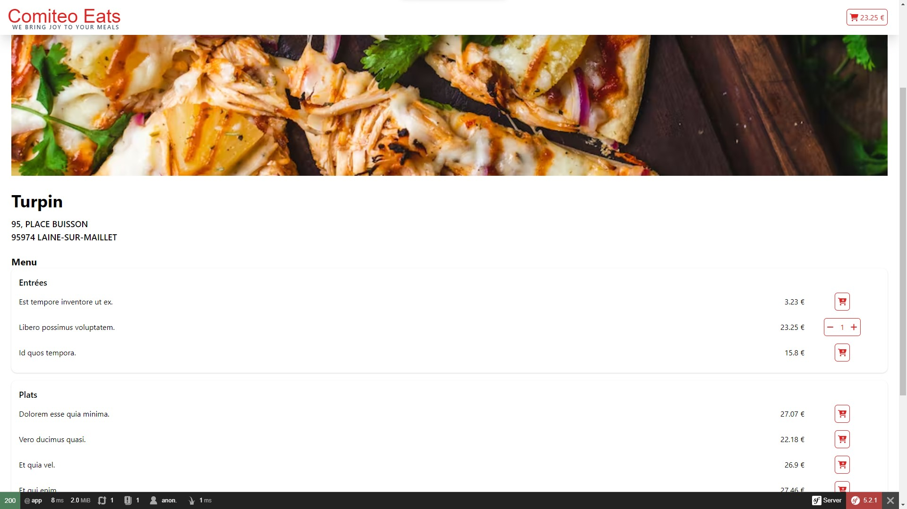
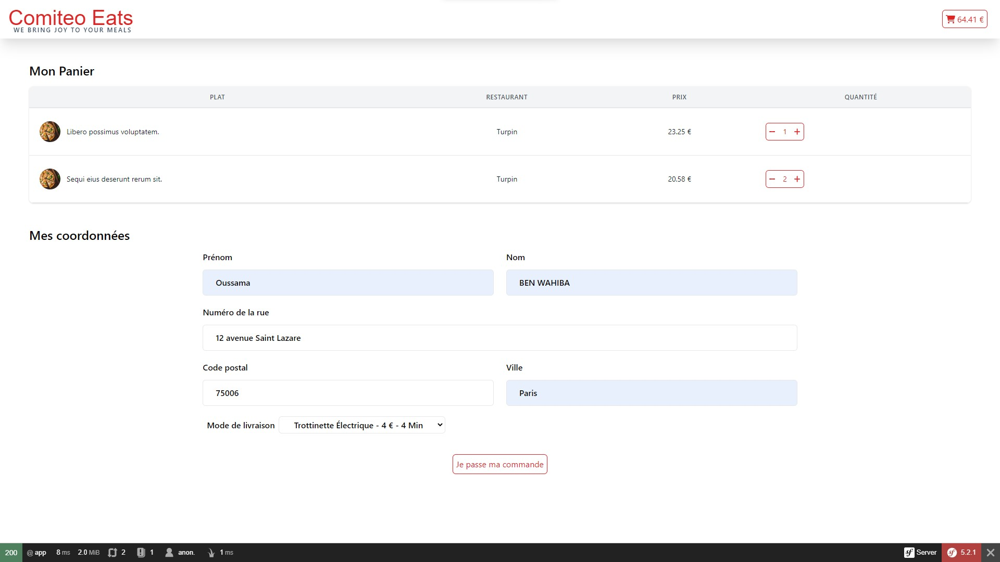
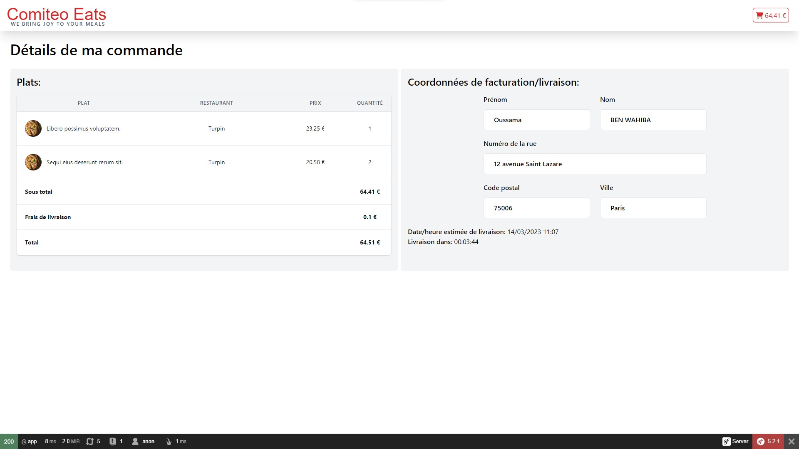

# Test technique Comiteo Vuejs

Le vieux README c'est par [ici](README.old.md) !

## Travail terminé
- Toute la Partie 1 (étapes de A à F)
- Mise à jour de quelques composants de la boilerplate (à spéciefier..)

## Changement d'api
Pour des raisons d'efficacité, j'ai opté à utiliser un live mock sur la plateforme MockApi pour contourner le problème lié au certificat expiré de l'api fourni. Pas de grands impacts fonctionnels: les seuls deux impacts consistent aux fait que MockApi n'accepte que des String pour les id (sur l'api d'origine les id restaurants sont des entiers), et qu'on ne peut utiliser que les 2 endpoints '/restaurants'  et '/orders' à cause des limites de la version gratuite.

On peut tout de même forcer l'utilisation de l'api d'origine en utilisant cette commande:

```bash
npm run build -- --comiteo
```
## Partie 2
WIP

## Screenshots

Parcours commande complet


Accueil (liste restaurants)



Détails restaurant


Panier


Récap commande
