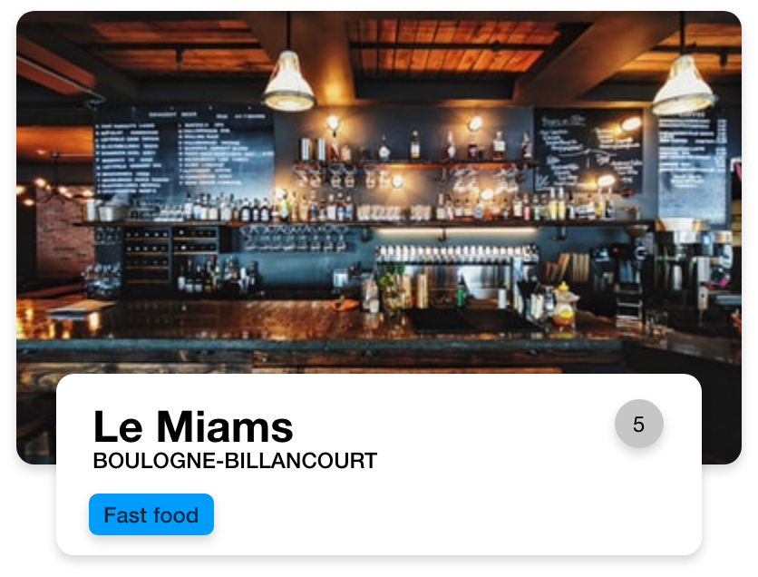
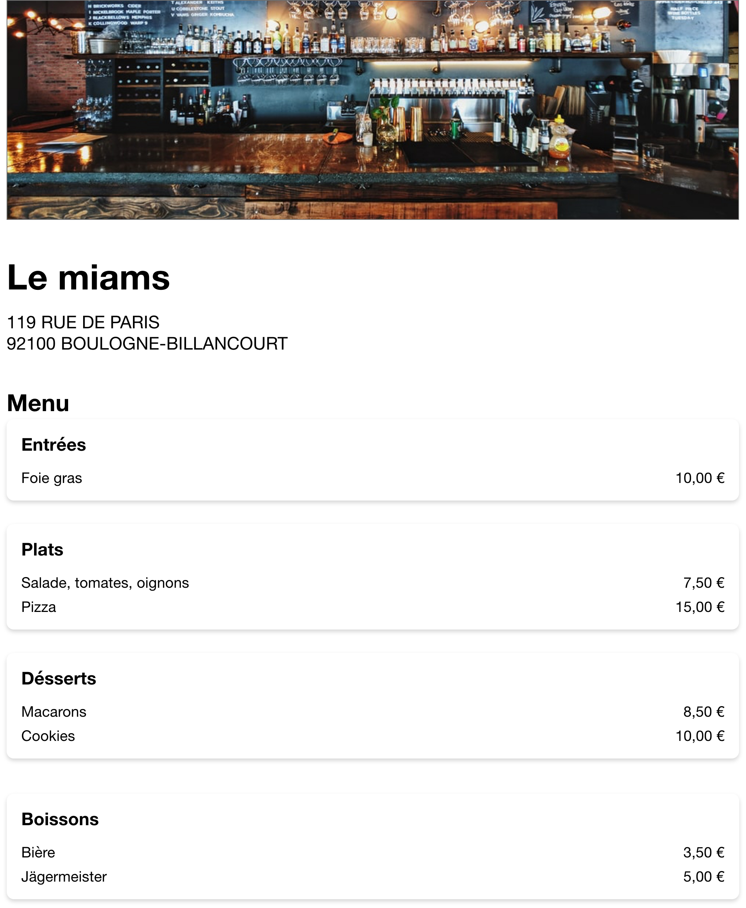
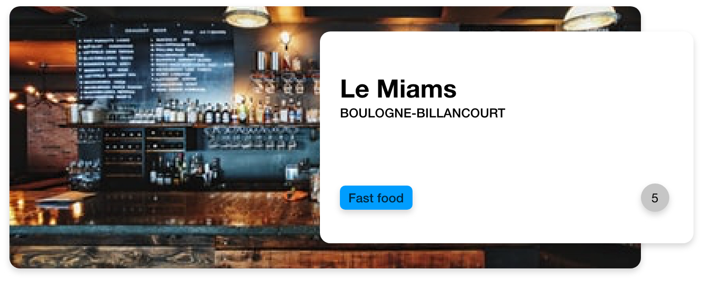

# Test technique Comiteo Vuejs

Dans ce test technique vous allez devoir développer un site de livraison à domicile de plats : ComiteoEats.

Le test se déroule en deux temps:
- Développement du site (Vuejs, Vue Router, Vuex, API)
- Amélioration du site avec des technologies et méchaniques avancées (Algolia, composants renderless, composants headless)

Dans un but d'efficacité, des librairies JS sont déjà installées: Vue, Vue-Router, Vuex, Axios, Algolia, Fontawesome, Luxon, TailwindCSS, Eslint. 
## Partie 1

### Etape A
But: Création d'une page qui liste tous les restaurants.

L'url de la page doit être `/`.

La liste des restaurants est récupérable avec ce [endpoint](#la-liste-des-restaurants) API.

Pour chaque restaurant de la liste il faut afficher :
- le nom
- la ville
- l'image de profil
- la catégorie
- la note

Il faut afficher la liste des restaurants sous forme de grille (2 colonnes).

Voici un exemple de design


### Etape B
But : Création d'une page qui affiche les informations d'un restaurant.

L'url de la page doit être `/restaurants/{id}`

Il faut afficher :
- le nom
- l'adresse
- la note
- le menu: chaque plat doit être dans une section (entrées, plats, desserts, boissons) et afficher son prix (**le prix récupéré par l'API est en centimes**)


Voici un exemple de design

### Etape C
But : création d'une barre de navigation

Ajouter le nom du site dans la barre de navigation.
Au clic sur le nom, l'utilisateur est redirigé sur la page de la liste des restaurants.

### Etape D
But : Ajouter des plats au panier

Utilisation de Vuex pour enregistrer les différents plats ajoutés au panier. 
Il est possible d'ajouter des plats de restaurants différents.

### Etape E
But : création de la page du panier

- Il faut ajouter une icône panier dans la barre de navigation (fontawesome)
- Au clic sur cette icône, l'utilisateur est redirigé sur la page du panier

l'url de la page du panier doit être `/cart`

Sur cette page doit apparaître la liste des plats ajoutés ainsi qu'un formulaire pour demander les informations de livraison :
- Prénom
- Nom
- Adresse (numéro + nom de rue, code postal, ville)

Un bouton doit permettre de créer la commande via un appel API sur ce [endpoint](#créer-une-commande). 

### Etape F
But : Création de la page de validation de la commande

L'url de la page doit être `/order_recap`

Une fois la commande créée il faut rediriger l'utilisateur sur la page validation de la commande.

Sur cette page doivent être affichés :
- Prénom
- Nom
- Adresse de livraison
- Liste des plats (nom et quantité)
- Sous-total des plats
- Montant des frais de livraison
- Montant total de la commande
- Le temps d'attente estimé pour la livraison (utilisation de la librairie Luxon). Date et heure au format 20/02/2021 16h36.

## Partie 2

Dans cette partie il n'y a pas d'étapes, uniquement différents exercices, indépendants les uns des autres.

### Restaurant mis en avant

Il faut ajouter dans la page d'index des restaurants une bannière (au dessus des résultats) qui affiche le restaurant mis en avant.

Pour obtenir les informations du restaurant mis en avant il faut interroger ce [endpoint](#récupérer-le-restaurant-mis-en-avant) API.

Il faut changer de restaurant mis en avant à chaque fois que l'on arrive sur cette page et au minimum 1 fois toutes les 20 secondes.

L'affichage de la bannière n'est pas le même en fonction du type de restaurant (asian, fast_food, italian).

On souhaite avoir un composant par type de restaurant, et un composant maître qui choisit le bon à afficher en fonction du type.
Il est attendu l'implémentation d'un composant switch qui va permettre de rendre le composant correspondant au type de restaurant.

### Algolia sur la page d'index des restaurants

Il faut utiliser la librairie Vuejs Algolia au lieu d'utiliser l'API

Voici les credentials Algolia:
- APPLICATION_ID: KEN31XLJGX 
- SEARCH_ONLY_KEY: 802ca5e65745e6e0b3476ca40388b678
- index: restaurants

Il faut implémenter:
- l'ajout d'un champ input pour rechercher un restaurant
- la possibilité de filtrer les restaurants par type.

### Choix de la méthode de livraison dans la page du panier

Il faut ajouter la sélection du mode de livraison (vélo, scooter, etc).

La liste des différents modes de livraison est disponible via ce [endpoint](#la-liste-des-méthodes-de-livraison) API.

Le but de cet exercice est de construire un/des composant(s) headless: très peu de template, uniquement de la logique js(scopedSlot). 

Ce(s) composants va devoir être utilisé pour créer le composant final de sélection de la méthode de livraison.

Il faut ensuite ajouter ce composant dans la page du panier pour que l'utilisateur puisse choisir son mode de livraison.

### Changer à la volée l'affichage des restaurants sur la page d'index des restaurants

Cet exercice peut être fait de deux manières : avec ou sans le composant headless créé dans l'exercice précédent.

Il faut créer un système qui permet de sélectionner l'affichage des restaurants en vue liste ou grille (la présentation actuelle) dans la page d'index des restaurants.

Voici un exemple de design


## Doc API
URL: `comiteo-eats.victormx.com`

### La liste des restaurants

[GET] `/api/restaurants`

### Récupérer les informations d'un restaurant

[GET] `/api/restaurants/{id}`

### Donner une note à un restaurant

[POST] `/api/restaurants/{id}/ratings`

Paramètres:
- rating: La note que l'on souhaite donner - entre 1 et 5
```json
{
    "rating": 4
}
```

### Créer une commande

[POST] `/api/orders`

Paramètres:
- first_name: Prénom
- last_name: Nom - String
- delivery_street_address: Adresse de la livraison - String
- delivery_zip_code: Code postal de la livraison - String
- delivery_city: Ville de la livraison - String
- delivery_method: Méthode de livraison (liste des méthodes sur le endpoint `/api/delivery_methods`) - String / optionnel: défaut = "bike")
- items: Tableau des plats - Array
- items.*.id: Id du plat - Int
- items.*.quantity: Quantité du plat - Int / min: 1

```json
{
    "first_name": "prenom",
    "last_name": "nom",
    "delivery_street_address": "119 rue de Paris",
    "delivery_zip_code": "92100",
    "delivery_city": "Boulogne-Billancourt",
    "delivery_method": "scooter",
    "items": [
        {
            "id": 1,
            "quantity": 1
        },
        {
            "id": 9,
            "quantity": 3
        }
    ]
}
```

### Récupérer le restaurant mis en avant

[GET] `/api/featured_restaurant`

### La liste des méthodes de livraison

[GET] `/api/delivery_methods`

